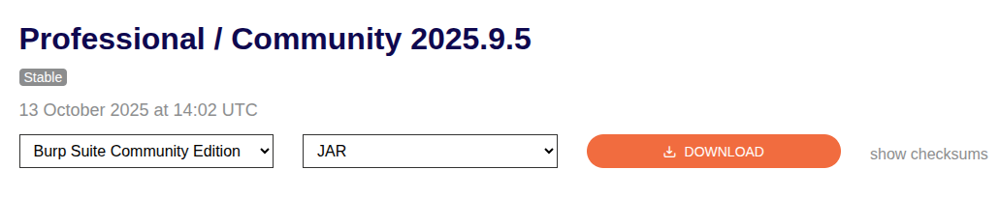

1. Confirm Burp JAR is in `~/Desktop/BurpSuite`
```bash
cd ~/Desktop/BurpSuite
ls
# burpsuite_community_v2025.9.5.jar
```
Official release page:
https://portswigger.net/burp/releases/professional-community-2025-9-5

 
2. (Optional) Check system Java — showed Java 17 (too old):
```bash
java -version
# OpenJDK version "17.0.16" ...
```

3. Try to run the jar (this failed because system Java < 21):
```bash
java -jar burpsuite_community_v2025.9.5.jar
# Error: UnsupportedClassVersionError -> needs Java 21
```

4. Create a folder for a user-local Java and download Java 21 (Temurin / Adoptium).
**Link used (Adoptium → GitHub release tarball):**
https://adoptium.net/download?link=https%3A%2F%2Fgithub.com%2Fadoptium%2Ftemurin21-binaries%2Freleases%2Fdownload%2Fjdk-21.0.9%252B10%2FOpenJDK21U-jre_x64_linux_hotspot_21.0.9_10.tar.gz&vendor=Adoptium

Download command (what we used):
```bash
cd ~
mkdir -p ~/opt/java
cd ~/opt/java
wget "https://adoptium.net/download?link=https%3A%2F%2Fgithub.com%2Fadoptium%2Ftemurin21-binaries%2Freleases%2Fdownload%2Fjdk-21.0.9%252B10%2FOpenJDK21U-jre_x64_linux_hotspot_21.0.9_10.tar.gz&vendor=Adoptium" -O OpenJDK21U-jre_x64_linux_hotspot_21.0.9_10.tar.gz
```

(If the above redirect URL ever 404s, open the Adoptium page and copy the current Linux x64 JRE tar.gz link: https://adoptium.net/.)

5. Extract the tarball and detect the extracted folder name:
```bash
cd ~/opt/java
tar -xzf OpenJDK21U-jre_x64_linux_hotspot_21.0.9_10.tar.gz
EXTRACTED_DIR="$(tar -tzf OpenJDK21U-jre_x64_linux_hotspot_21.0.9_10.tar.gz | head -1 | cut -f1 -d'/')"
echo "Detected java folder: $EXTRACTED_DIR"
# Detected: jdk-21.0.9+10-jre
```

6. Launch Burp using the Java 21 binary (no sudo):
Foreground:
```bash
~/opt/java/jdk-21.0.9+10-jre/bin/java -jar ~/Desktop/BurpSuite/burpsuite_community_v2025.9.5.jar
```
Background (detached, logs to ~/burp.log):
```bash
nohup ~/opt/java/jdk-21.0.9+10-jre/bin/java -jar ~/Desktop/BurpSuite/burpsuite_community_v2025.9.5.jar > ~/burp.log 2>&1 &
echo "Burp started (PID $!). Logs: ~/burp.log"
```

7. Create a short launcher script (`~/bin/burp`) so you can just type `burp`:
```bash
mkdir -p ~/bin
cat > ~/bin/burp <<'EOF'
#!/usr/bin/env bash
JAVA_HOME="$HOME/opt/java/jdk-21.0.9+10-jre"
exec "$JAVA_HOME/bin/java" -jar "$HOME/Desktop/BurpSuite/burpsuite_community_v2025.9.5.jar" "$@"
EOF
chmod +x ~/bin/burp
```

8. Ensure `~/bin` is in your `PATH` (add once to `~/.profile` and apply now):
```bash
grep -qxF 'export PATH="$HOME/bin:$PATH"' ~/.profile || echo 'export PATH="$HOME/bin:$PATH"' >> ~/.profile
export PATH="$HOME/bin:$PATH"
# Now you can run:
burp
```

9. (Optional) Add Burp to the desktop/app menu:
```bash
mkdir -p ~/.local/share/applications
cat > ~/.local/share/applications/burp.desktop <<EOF
[Desktop Entry]
Type=Application
Name=Burp Suite Community
Comment=Burp Suite (user install)
Exec=$HOME/bin/burp
Icon=utilities-terminal
Terminal=false
Categories=Development;Security;
EOF
```

10. How to stop Burp (background):
```bash
pkill -f burpsuite_community_v2025.9.5.jar
# or pgrep -f burpsuite_community_v2025.9.5.jar  # to list PIDs
```

---

# Official links to include
- Burp Suite Community (download page): https://portswigger.net/burp/releases/professional-community-2025-9-5
- Temurin (Adoptium) downloads: https://adoptium.net/

---
